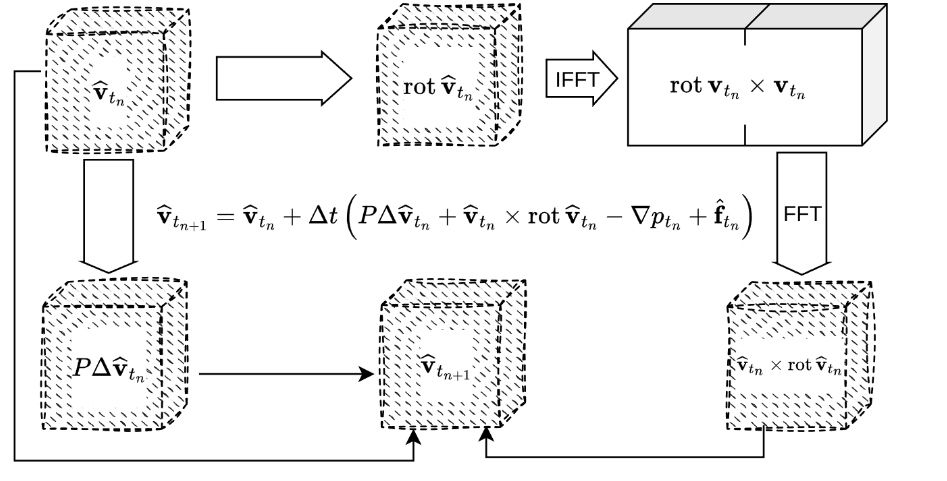
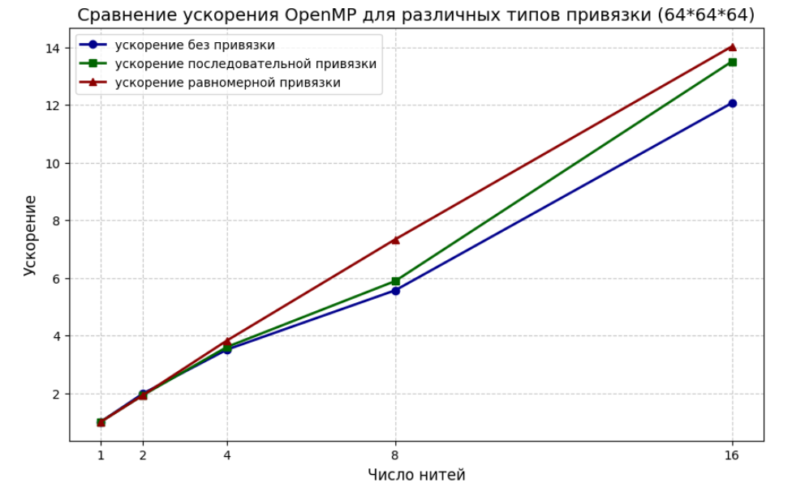
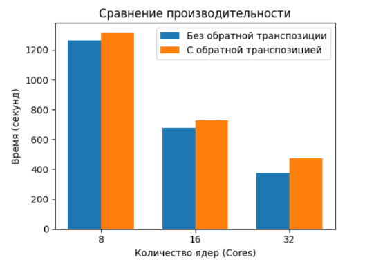
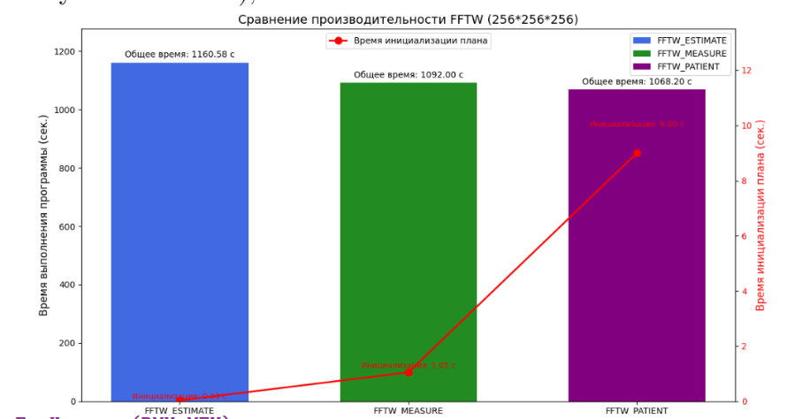
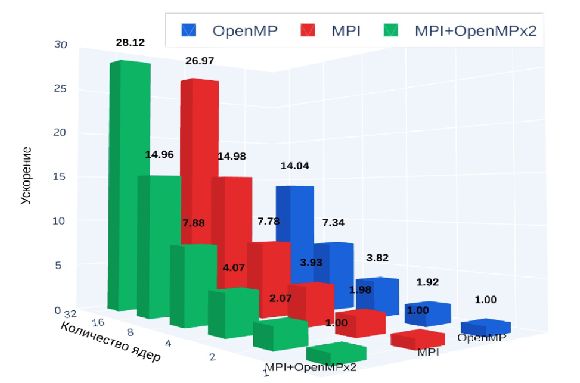
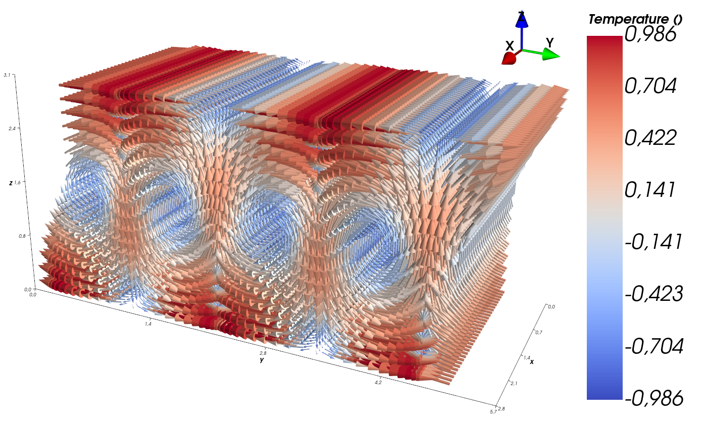
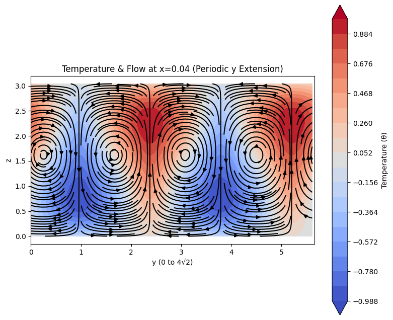

# 三维周期性 Navier-Stokes 方程伪谱求解器

## 项目简介

本项目实现了三维周期性边界条件下不可压缩粘性流体的伪谱数值求解器，覆盖从本科阶段的 MPI/OpenMP 并行实现，到研究生阶段的多 FFT 库移植与 GPU 加速版本。

**作者：郭浩杰**

---

## 目录

- [物理模型](#物理模型)
- [数值方法](#数值方法)
- [本科阶段工作（FFTW + MPI/OpenMP）](#本科阶段工作)
- [研究生阶段工作（多库移植 + GPU 加速）](#研究生阶段工作)
- [代码结构](#代码结构)
- [编译与运行](#编译与运行)
- [验证与结果](#验证与结果)

---

## 物理模型

求解三维周期性边界条件下的不可压缩 Navier-Stokes 方程：

$$\frac{\partial \mathbf{v}}{\partial t} + (\mathbf{v} \cdot \nabla)\mathbf{v} = -\nabla p + \nu \Delta \mathbf{v} + \mathbf{f}$$

$$\nabla \cdot \mathbf{v} = 0$$

其中 $\mathbf{v}$ 为速度场，$p$ 为压力，$\nu$ 为运动粘度，$\mathbf{f}$ 为外力。

求解域为 $[0, 2\pi]^3$ 的周期性立方体，网格分辨率 $64^3$，时间步长 $dt = 5 \times 10^{-5}$。

**热对流扩展：** 在方程中加入浮力项 $\Pr \cdot \theta \, \mathbf{e}_3$，描述温差引起的对流运动，其中 $\theta$ 为温度扰动，$\Pr$ 为普朗特数。

---

## 数值方法

### 空间离散：伪谱方法

将速度场展开为傅里叶级数，利用快速傅里叶变换（FFT）在谱空间中高效计算导数（谱空间中微分等价于乘以波数 $ik$），在物理空间中计算非线性项，从而获得谱方法的高精度。

### 时间积分：RK4

使用经典四阶 Runge-Kutta 方法进行时间推进，精度为 $O(\tau^4)$。

### 投影法（压力修正）

每个时间步结束后，在谱空间对速度场做 Helmholtz 投影，消除散度，保证不可压缩约束 $\nabla \cdot \mathbf{v} = 0$。

### 归一化约定（统一）

所有版本均采用**非归一化 DFT 约定**：
- 正变换：$\hat{V} = \mathrm{DFT}(V)$（不除以 $N$）
- 逆变换后手动除以 $N$ 得到物理值

---

## 本科阶段工作

**题目：** 基于并行计算系统的粘性不可压缩流体流动伪谱方法数值模拟

**计算平台：** 莫斯科国立大学 VMK 学院 Polus 集群（4 节点，每节点 2 块 10 核处理器）

### 并行算法

核心算法如下图所示。谱空间（带帽子的量 $\hat{V}$）和物理空间（不带帽子的量 $V$）之间通过 FFT/iFFT 转换，非线性项在物理空间中计算，导数在谱空间中计算。



### OpenMP 并行优化

实现了三种线程绑定策略：
- **无绑定**：线程由操作系统动态调度
- **顺序绑定**：线程依次绑定到同一处理器的核，再到另一处理器
- **均匀绑定**：线程均匀分布在两个处理器的核上

实验结果表明，**均匀绑定**加速效果最佳（红线）：



### MPI 并行优化

数据按 x 方向分层分布（1D slab 分解）。主要优化手段：

**优化 1：消除逆转置**

3D FFT 需对 x 方向做全局转置，FFTW 完成后会自动执行逆转置还原数据布局。由于我们在谱空间中直接操作，可跳过逆转置，直接使用转置后的数据布局计算：



**优化 2：FFTW 计划选择**

对比 `FFTW_ESTIMATE`、`FFTW_MEASURE`、`FFTW_PATIENT` 三种计划，`FFTW_PATIENT` 预计算时间最长但执行性能最优（紫色柱）：



### MPI + OpenMP 混合并行

结合两种并行技术，混合版本在所有参数下均取得最佳加速比：



### 热对流数值实验

在 Navier-Stokes 方程中加入热浮力项，对 Rayleigh-Bénard 对流问题进行数值模拟。

**可视化结果：** 速度场和竖直截面流场清晰呈现对流涡胞结构，与理论预期吻合。





数值解的动能随时间演化收敛于解析值，验证了程序的正确性。

### 本科阶段主要成果

- 实现了基于 MPI、OpenMP、MPI+OpenMP 的三种并行求解器
- 验证了良好的并行可扩展性
- 完成热对流数值实验，结果与理论吻合

---

## 研究生阶段工作

### 动机：突破 FFTW 的 1D Slab 分解限制

FFTW MPI 版本仅支持 **1D slab 分解**（沿单一维度切分），当进程数超过网格一维大小时无法继续扩展。为支持更大规模并行，需要引入 **2D pencil 分解**（沿两个维度切分），理论上可将并行进程数从 $O(N)$ 扩展到 $O(N^2)$。

我们对三个支持 2D pencil 分解的 FFT 库进行了移植与性能研究：

### 多 FFT 库移植

#### heFFTe（Highly Efficient FFT for Exascale）

- **文件：** `NavierStokes_periodic_heffte_v2.cpp`
- **特性：** 支持 CPU/GPU 后端，2D pencil 分解，ORNL 开发
- R2C 沿 z 方向，$k_z \in [0, N_z/2]$；$k_x, k_y$ 按标准折叠规则
- 逆变换不破坏输入，无需复制缓冲区
- `forward(scale::none)` + `backward(scale::full)`（自动 $/N$）

#### p3dfft

- **文件：** `NavierStokes_periodic_p3dfft.cpp`
- **特性：** 成熟的 2D pencil 分解库，广泛用于气候/流体模拟
- R2C 沿 x 方向，$k_x \in [0, N_x/2]$；$k_y, k_z$ 需手动折叠
- `btran_c2r` 销毁输入，每次调用前必须复制缓冲区
- 实空间含 padding，需用 `memsize` 计算内存大小

#### AccFFT

- **文件：** `NavierStokes_periodic_accfft.cpp`
- **特性：** 面向加速器的 2D pencil 分解库
- 逆变换不自动归一化，需手动 $/N_{\mathrm{total}}$
- Nyquist 分量（$= N/2$）置零以保证实对称性
- 已验证：L2 误差 $\approx 2.5 \times 10^{-14}$

### 谱导数验证

针对每个库，单独编写了谱导数验证程序：

| 文件 | 库 | 状态 |
|------|-----|------|
| `test_spectral_derivative.cpp` | FFTW | 已通过 |
| `test_spectral_derivative_heffte.cpp` | heFFTe | 已通过 |
| `test_spectral_derivative_p3dfft.cpp` | p3dfft | 已通过 |
| `test_spectral_derivative_accfft.cpp` | AccFFT | 已通过（误差 $\sim 10^{-14}$）|

### 解析解（Taylor-Green 涡变体）

用于代码验证的解析解：

$$V_1 = V_2 = (t^2+1) e^{\sin(3x+3y)} \cos(6z)$$
$$V_3 = -(t^2+1) e^{\sin(3x+3y)} \cos(3x+3y) \sin(6z)$$
$$p = (t^2+1) \cos x \cos y \cos z$$

验证参数：$64^3$ 网格，$dt = 5 \times 10^{-5}$，运行 10 步。

### GPU 加速（规划中）

GPU 版本分三个阶段实现：

| 阶段 | 描述 | 状态 |
|------|------|------|
| 单节点单 GPU | 基于 cuFFT 的单 GPU 实现 | 开发中 |
| 单节点多 GPU | NVLink/PCIe 多 GPU 扩展 | 规划中 |
| 多节点多 GPU | MPI + cuFFT/heFFTe GPU 后端 | 规划中 |

单 GPU 版本设计要点（`NavierStokes_periodic_cufft.cu`，待加入）：
- 使用 `cufftPlan3d` 全局复用两个 plan（D2Z / Z2D）
- 实空间无 padding：`RIDX(i,j,k) = i*NY*NZ + j*NZ + k`
- 归一化约定与 FFTW 一致，forward 后 kernel 手动 $/N$
- Z2D 可能销毁输入，viscous 算子必须在 nonlinear 之前执行
- 显存估算：$128^3$ 约 599 MB（10 个实数数组 + 27 个复数数组）

---

## 代码结构

```
.
├── NavierStokes_periodic_fftw.cpp          # FFTW MPI 版（1D slab，参考实现）
├── NavierStokes_periodic_heffte_v2.cpp     # heFFTe 版（2D pencil）
├── NavierStokes_periodic_p3dfft.cpp        # p3dfft 版（2D pencil）
├── NavierStokes_periodic_accfft.cpp        # AccFFT 版（2D pencil，已验证）
├── test_spectral_derivative.cpp            # FFTW 谱导数验证
├── test_spectral_derivative_heffte.cpp     # heFFTe 谱导数验证
├── test_spectral_derivative_p3dfft.cpp     # p3dfft 谱导数验证
├── test_spectral_derivative_accfft.cpp     # AccFFT 谱导数验证
├── Makefile_periodic                       # FFTW 版编译
├── Makefile_heffte                         # heFFTe 版编译
├── Makefile_p3dfft                         # p3dfft 版编译
├── Makefile_accfft                         # AccFFT 版编译
└── pic/                                    # 实验结果图片
    ├── 并行算法.png
    ├── 不同绑定下的openmp结果对比.png
    ├── 对流实验可视化图片1.png
    ├── 对流实验可视化图片2.png
    ├── MPI版本优化1取消装置结果对比.png
    ├── MPI不同plan的优化.png
    └── MPI+OpenMp混合版本得到最佳优化.png
```

---

## 编译与运行

### 依赖

| 库 | 版本要求 | 安装路径 |
|----|---------|---------|
| FFTW3 MPI | ≥ 3.3 | 系统（`/usr/lib/x86_64-linux-gnu`）|
| heFFTe | ≥ 2.3 | `~/.local` |
| p3dfft | ≥ 2.7 | `~/.local` |
| AccFFT | latest | `~/.local`（源码：`~/accfft`）|
| MPI | OpenMPI 或 MPICH | 系统 |

### 编译

```bash
# FFTW 版
make -f Makefile_periodic

# heFFTe 版
make -f Makefile_heffte

# p3dfft 版
make -f Makefile_p3dfft

# AccFFT 版
make -f Makefile_accfft
```

### 运行示例

```bash
# 4 进程运行 FFTW 版
mpirun -np 4 ./navier_stokes_periodic

# 8 进程运行 heFFTe 版（2D pencil）
mpirun -np 8 ./navier_stokes_heffte_v2
```

---

## 验证与结果

### 精度验证

各版本在 Taylor-Green 涡解析解上的 L2 误差（10 步，$dt=5\times10^{-5}$）：

| 实现 | L2 误差 |
|------|---------|
| FFTW MPI | $\sim 10^{-14}$ |
| heFFTe | $\sim 10^{-14}$ |
| p3dfft | $\sim 10^{-14}$ |
| AccFFT | $\sim 2.5\times10^{-14}$ |

所有版本均达到机器精度量级，验证了实现的正确性。

### 可扩展性

- OpenMP：均匀绑定策略在双路服务器上加速效果最佳
- MPI：通过消除逆转置和使用 `FFTW_PATIENT` 计划显著降低计算时间
- MPI+OpenMP 混合：加速比优于纯 MPI 或纯 OpenMP
- 2D pencil 分解（heFFTe/p3dfft/AccFFT）：突破 1D slab 的进程数限制，支持更大规模并行
